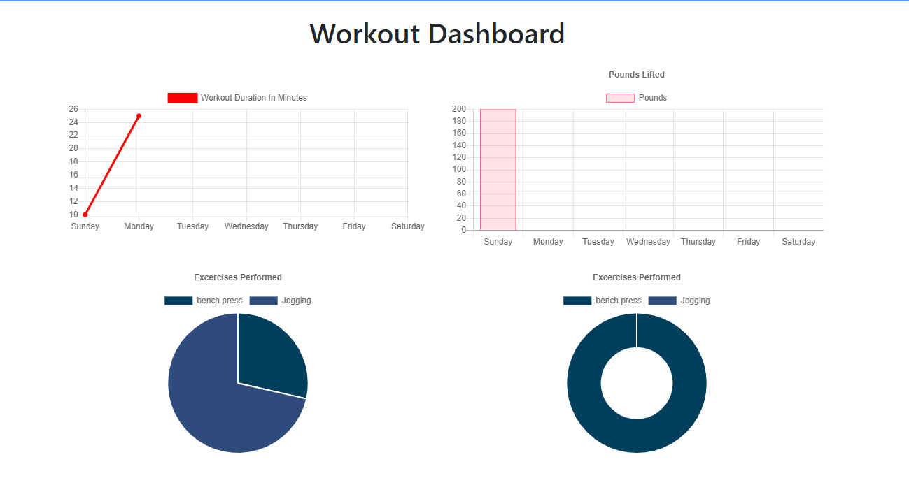

# Fit-Guru
A workout tracker that allows the user to create and track workouts daily. 

## Description 
Say Hello to Fit Guru! An app for athletes and users who want to track their fitness workouts. With Fit Guru, users are able to create and track daily workouts. Log your exercises by name, type, sets, reps, etc. With Fit Guru, you can reach your fitness goals easier than ever before. 

## Features 
With Fit-Guru, you can see your previous workouts.

You can Add Resistance or Cardio Workouts.

When you choose to add an exercise, you can put in the type of exercies, sets, reps, and duration. 

Clicking the Fitness Tracker Dashboard, will take you to your stats page. 

## TO DO 
- [x] ADD exercises to previous workout plan
- [x] ADD new exercies to new workout plan
- [x] VIEW combined weight of multiple exercise on stats page
- [ ] VIEW total workout duration

W/ Mongo 
- [x] CREATE workout database
- [x] CREATE database schema 

W/ Express 
- [x] CREATE HTML routes 
- [x] CREATE API routes

Deployment
- [x] Set up database on MongoDB Atlas 
- [x] DEBUG code so that when deployed on Heroku, the last workout is displayed